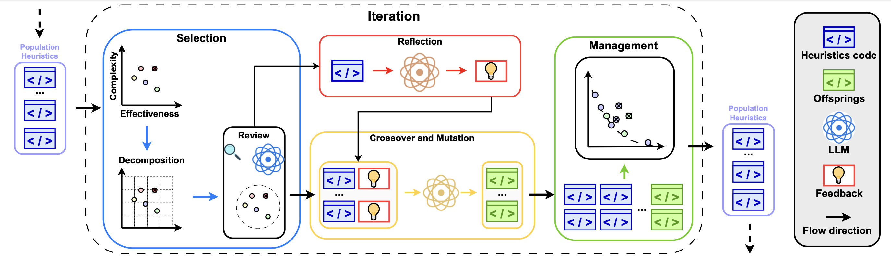
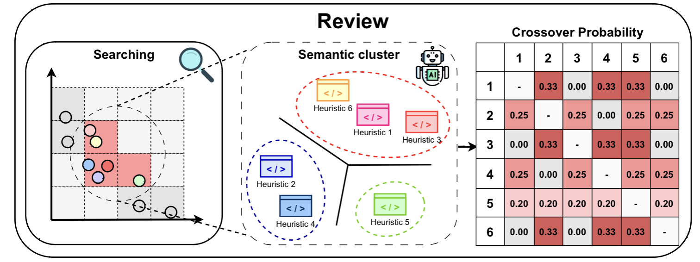
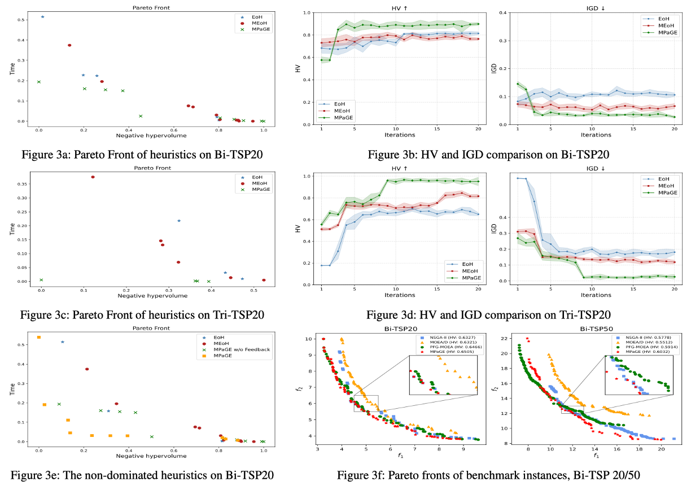
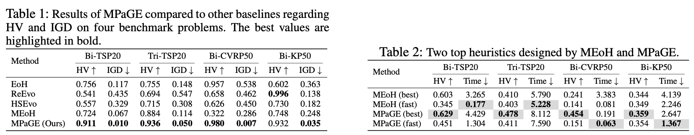
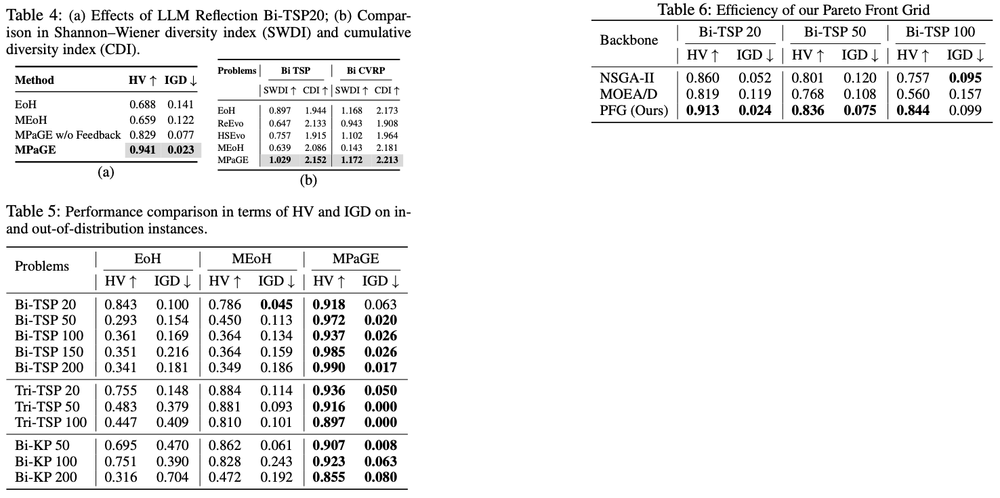

# 🌟 MPaGE: Pareto-Grid-Guided Large Language Models for Fast and High-Quality Heuristics Design in Multi-Objective Combinatorial Optimization

🚀 **Official Codebase** for the paper:  
**[_MPaGE: Pareto-Grid-Guided Large Language Models for Fast and High-Quality Heuristics Design in Multi-Objective Combinatorial Optimization_](https://www.arxiv.org/abs/2507.20923)**

🧠 This repository provides the full implementation of **MPaGE**, the first framework that systematically integrates **Large Language Models (LLMs)** with the **Simple Evolutionary Multi-objective Optimization (SEMO)** paradigm and **Pareto Front Grid** guidance.

MPaGE is designed to solve **Multi-objective Combinatorial Optimization (MOCO)** problems by effectively balancing:
- ⏱ Runtime efficiency
- 🎯 Solution quality
- 🌐 Semantic diversity

---
## Overview 💡

Our approach curates heuristic algorithms for the **Simple Evolutionary Multi-objective Optimization (SEMO)** paradigm, leveraging the **Pareto Front Grid (PFG)** to guide the design of LLM-based variation heuristics.



By partitioning the objective space into grids and retaining leading individuals from promising regions, MPaGE enhances both **solution quality** and **search efficiency**.
From these regions, **MPaGE** constructs a pool of elitist candidates and employs **Large Language Models (LLMs)** to assess their **semantic structures**, clustering them into groups with similar logic. Variation is then performed **with respect to these clusters**, promoting **semantic diversity** and reducing redundancy within the heuristic population.



To the best of our knowledge, this is the **first comprehensive evaluation** of LLM-generated heuristics on standard **Multi-objective Combinatorial Optimization Problems (MOCOP)**, addressing solution quality, computational efficiency, and semantic diversity.

---

## 🔍 Main Contributions

- 🧩 We propose **MPaGE**, a novel framework that systematically integrates **LLMs** with the **SEMO paradigm** and **PFG** to solve **MOCOP** problems — balancing runtime, solution quality, and semantic diversity.

- 🧠 We leverage **LLMs** to verify the **logical structure** of heuristics and perform **cross-cluster recombination**, enhancing diversity and reducing redundancy through **logically dissimilar variations**.

- 📊 We conduct **extensive experiments** on standard **MOCOP benchmarks**, demonstrating consistent improvements in runtime efficiency, solution quality, and semantic diversity over both **LLM-based baselines** and traditional **multi-objective evolutionary algorithms (MOEAs)**.

---
## 🧪 Experiment Results

We evaluate the proposed **MPaGE** framework on four widely recognized **Multi-objective Combinatorial Optimization Problems (MOCOPs)** that have been extensively studied in the literature:

- 🛣 **Bi-objective Traveling Salesman Problem (Bi-TSP)**
- 🛣 **Tri-objective Traveling Salesman Problem (Tri-TSP)**
- 🚚 **Bi-objective Capacitated Vehicle Routing Problem (Bi-CVRP)**
- 🎒 **Bi-objective Knapsack Problem (Bi-KP)**




---
## 📋 Quick Start Guide

### 1. Installation & Setup

#### Prerequisites
- Python 3.8+ 
- OpenAI API key (or compatible LLM API)

#### Install Dependencies
```bash
git clone https://github.com/langkhachhoha/MPaGE.git
cd MPaGE
pip install -r requirements.txt
```

#### Set Up API Keys
Create two files in the root directory:

**`secret.txt`** - Your main LLM API key:
```
your-openai-api-key-here
```

**`secret_cluster.txt`** - Your clustering LLM API key (can be the same):
```
your-openai-api-key-here
```

### 2. Running MPaGE

#### Basic Usage
```bash
python main.py
```

#### Configuration Options
Edit `main.py` to customize your experiment:

```python
# Choose your optimization problem (uncomment one):
from llm4ad.task.optimization.bi_tsp_semo import BITSPEvaluation as ProblemEvaluation
# from llm4ad.task.optimization.tri_tsp_semo import TRITSPEvaluation as ProblemEvaluation
# from llm4ad.task.optimization.bi_cvrp import BICVRPEvaluation as ProblemEvaluation
# from llm4ad.task.optimization.bi_kp import BIKPEvaluation as ProblemEvaluation

# Configure LLM settings
llm = HttpsApiOpenAI(
    base_url='https://api.openai.com',
    api_key=llm_api_key,
    model='gpt-4o-mini',  # or 'gpt-4', 'gpt-3.5-turbo'
    timeout=30
)

# Configure MPaGE parameters
method = MPaGE(
    llm=llm,
    llm_cluster=llm_cluster,
    profiler=EoHProfiler(log_dir='logs', log_style='complex'),
    evaluation=task,
    max_sample_nums=200,    # Maximum function evaluations
    max_generations=20,     # Maximum generations
    pop_size=6,            # Population size
    num_samplers=1,        # Number of parallel samplers
    num_evaluators=1,      # Number of parallel evaluators
    # llm_review=True      # Enable LLM review (optional)
)
```

### 3. Understanding the Output

#### Log Directory Structure
```
logs/
└── YYYYMMDD_HHMMSS_Problem_METHOD/
    ├── run_log.txt              # Execution log
    ├── population/              # Population evolution data
    │   ├── generation_0.json
    │   ├── generation_1.json
    │   └── ...
    └── samples/                 # Generated heuristic samples
        └── samples_0~200.json   # All sampled functions
```

#### Key Metrics
- **Hypervolume**: Measures solution quality and diversity
- **Runtime**: Total execution time
- **Function Evaluations**: Number of LLM-generated heuristics tested
- **Pareto Front**: Non-dominated solutions found

---
## How to use? 🔧

### Step-by-Step Usage Guide

### 1. Install the dependencies

```bash
# Clone the repository
git clone https://github.com/langkhachhoha/MPaGE.git
cd MPaGE

# Install required packages
pip install -r requirements.txt
```

### 2. Set your LLM API key

Create the required API key files in the project root:

```bash
# Create main API key file
echo "your-openai-api-key-here" > secret.txt

# Create cluster API key file (can be the same key)
echo "your-openai-api-key-here" > secret_cluster.txt
```

### 3. Choose Your Optimization Problem

MPaGE supports multiple multi-objective combinatorial optimization problems. In `main.py`, uncomment the problem you want to solve:

```python
# Bi-objective Traveling Salesman Problem (Default)
from llm4ad.task.optimization.bi_tsp_semo import BITSPEvaluation as ProblemEvaluation

# Tri-objective Traveling Salesman Problem
# from llm4ad.task.optimization.tri_tsp_semo import TRITSPEvaluation as ProblemEvaluation

# Bi-objective Capacitated Vehicle Routing Problem
# from llm4ad.task.optimization.bi_cvrp import BICVRPEvaluation as ProblemEvaluation

# Bi-objective Knapsack Problem
# from llm4ad.task.optimization.bi_kp import BIKPEvaluation as ProblemEvaluation
```

### 4. Configure LLM Settings

#### Option A: OpenAI API (Recommended)
```python
llm = HttpsApiOpenAI(
    base_url='https://api.openai.com',
    api_key=llm_api_key,
    model='gpt-4o-mini',  # Options: 'gpt-4', 'gpt-4o', 'gpt-3.5-turbo'
    timeout=30
)
```

#### Option B: Custom HTTPS API
```python
llm = HttpsApi(
    host='your-api-host.com',  # Without 'https://'
    key=llm_api_key,
    model='your-model-name',
    timeout=30
)
```

### 5. Configure MPaGE Parameters

Customize the algorithm parameters according to your needs:

```python
method = MPaGE(
    llm=llm,                    # Main LLM for heuristic generation
    llm_cluster=llm_cluster,    # LLM for semantic clustering
    profiler=EoHProfiler(log_dir='logs', log_style='complex'),
    evaluation=task,            # Problem evaluation instance
    
    # Core Evolution Parameters
    max_sample_nums=200,        # Max function evaluations (stopping criterion)
    max_generations=20,         # Max generations (stopping criterion)
    pop_size=6,                # Population size
    
    # Parallel Processing
    num_samplers=1,             # Parallel LLM sampling threads
    num_evaluators=1,           # Parallel evaluation threads
    
    # Optional Advanced Features
    # llm_review=True,          # Enable LLM review of population
    # use_e2_operator=True,     # Enable E2 exploration operator
    # use_m1_operator=True,     # Enable M1 mutation operator
    # use_m2_operator=True,     # Enable M2 mutation operator
)
```

### 6. Run MPaGE

```bash
python main.py
```

### 7. Monitor Progress

During execution, you'll see output like:
```
[2025-01-15 10:30:25] Starting MPaGE evolution...
[2025-01-15 10:30:30] Generation 1/20: Best HV = 0.845
[2025-01-15 10:31:15] Generation 2/20: Best HV = 0.892
[2025-01-15 10:32:00] LLM generated new heuristic: 2-opt with smart selection
...
```

### 8. Analyze Results

Check the `logs/` directory for detailed results:

```bash
ls logs/
# Output: 20250115_103025_Problem_MPaGE/

cd logs/20250115_103025_Problem_MPaGE/
ls
# Output: run_log.txt  population/  samples/
```

## 🔧 Advanced Configuration

### Custom Problem Setup

To add your own optimization problem, create a new directory in `llm4ad/task/optimization/`:

```
your_problem/
├── __init__.py          # Package initialization
├── evaluation.py        # Objective functions
├── get_instance.py      # Instance data loading
├── paras.yaml          # Problem parameters
└── template.py         # Problem template and description
```

### Parameter Tuning Guidelines

| Parameter         | Recommended Range | Description |
|------------------|-------------------|-------------|
| `max_sample_nums` | 100-500          | Higher for complex problems |
| `max_generations` | 10-50            | Depends on convergence rate |
| `pop_size`       | 4-10             | Balance diversity vs. efficiency |
| `timeout`        | 20-60 seconds    | Adjust based on LLM response time |

### LLM Model Selection

| Model | Speed | Quality | Cost | Recommended Use |
|-------|-------|---------|------|-----------------|
| `gpt-3.5-turbo` | Fast | Good | Low | Quick experiments |
| `gpt-4o-mini` | Medium | Very Good | Medium | **Recommended for most cases** |
| `gpt-4` | Slow | Excellent | High | High-quality results |

### Troubleshooting

#### Common Issues:

1. **API Key Errors**:
   ```bash
   # Verify your API keys
   cat secret.txt
   cat secret_cluster.txt
   ```

2. **Memory Issues**:
   ```python
   # Reduce population size
   pop_size=4
   max_sample_nums=100
   ```

3. **Timeout Errors**:
   ```python
   # Increase timeout
   timeout=60
   ```

4. **Installation Issues**:
   ```bash
   # Use specific Python version
   pip install --python=python3.8 -r requirements.txt
   ```
## 📊 Hyperparameter Reference

You can flexibly change the following hyperparameters in `main.py`:

### Core Parameters

| Parameter         | Type | Default | Description |
|------------------|------|---------|-------------|
| `llm`            | LLM Object | - | The LLM model used to generate heuristics (e.g., GPT-4, GPT-3.5-turbo) |
| `llm_cluster`    | LLM Object | - | The LLM model for clustering heuristics based on semantic structure |
| `evaluation`     | Evaluation | - | Problem evaluation instance that defines scoring mechanism |
| `max_generations`| int | 20 | Maximum evolution generations (stops early if `max_sample_nums` reached) |
| `max_sample_nums`| int | 200 | Maximum function evaluations (stops early if `max_generations` reached) |
| `pop_size`       | int | 6 | Population size maintained during evolutionary process |

### Advanced Parameters

| Parameter         | Type | Default | Description |
|------------------|------|---------|-------------|
| `num_samplers`   | int | 1 | Number of parallel LLM sampling threads |
| `num_evaluators` | int | 1 | Number of parallel evaluation threads |
| `selection_num`  | int | pop_size//2 | Number of individuals selected for crossover operations |
| `use_e2_operator`| bool | True | Enable E2 operator for logic-driven exploration |
| `use_m1_operator`| bool | True | Enable M1 mutation operator for local search |
| `use_m2_operator`| bool | True | Enable M2 mutation operator for diversification |
| `llm_review`     | bool | False | Enable LLM review to filter low-quality logic before crossover |

### LLM Configuration

| Parameter     | Type | Default | Description |
|--------------|------|---------|-------------|
| `base_url`   | str | - | API endpoint URL (e.g., 'https://api.openai.com') |
| `api_key`    | str | - | Your LLM API authentication key |
| `model`      | str | - | Model name ('gpt-4o-mini', 'gpt-4', 'gpt-3.5-turbo') |
| `timeout`    | int | 30 | Request timeout in seconds |
| `temperature`| float | 0.7 | Sampling temperature for text generation |
| `max_tokens` | int | 8192 | Maximum tokens in LLM response |

### Problem-Specific Settings

Each optimization problem has its own configuration in `paras.yaml`:

#### Bi-TSP Example (`llm4ad/task/optimization/bi_tsp_semo/paras.yaml`)
```yaml
name: BITSPEvolution
timeout_seconds: 20  # Evaluation timeout per heuristic
```

#### Custom Problem Template
```yaml
name: YourProblemName
timeout_seconds: 30
custom_param_1: value1
custom_param_2: value2
```

## 🏗️ Setting Up Custom Optimization Problems

To set up **MPaGE** for your custom optimization problem, refer to the task configuration files in: `llm4ad/task/optimization/`

### Directory Structure
Each problem requires the following structure:
```
llm4ad/task/optimization/your_problem/
├── 📄 __init__.py          # Makes directory a Python package
├── 📄 evaluation.py        # Contains objective functions and fitness evaluation
├── 📄 get_instance.py      # Loads problem instance data from files
├── 📄 paras.yaml          # Parameter settings in YAML format
└── 📄 template.py         # Algorithm template and problem description
```

### Implementation Guide

#### 1. `evaluation.py` - Define Objective Functions
```python
from llm4ad.base import Evaluation
import numpy as np

class YourProblemEvaluation(Evaluation):
    def __init__(self):
        self.instance = self.load_instance()
        
    def evaluate_function(self, heuristic_func, *args, **kwargs):
        """Evaluate a heuristic function on your problem"""
        # Implement your evaluation logic
        # Return fitness scores, hypervolume, etc.
        pass
        
    def load_instance(self):
        """Load problem instance data"""
        # Load your problem data
        pass
```

#### 2. `template.py` - Problem Template & Description
```python
template_program = '''
import numpy as np
from typing import List, Tuple

def your_heuristic_function(
    current_solution: np.ndarray,
    problem_data: dict,
    **kwargs
) -> np.ndarray:
    """
    Your heuristic function template.
    
    Args:
        current_solution: Current solution representation
        problem_data: Problem-specific data and constraints
        
    Returns:
        Improved solution
    """
    # Template implementation
    new_solution = current_solution.copy()
    # Apply your improvements here
    return new_solution
'''

task_description = """
Describe your optimization problem here.
Explain the objectives, constraints, and what makes a good heuristic.
Provide guidance for the LLM on how to design effective heuristics.
"""
```

#### 3. `get_instance.py` - Data Loading
```python
import numpy as np

class GetData:
    def __init__(self, instance_name="default"):
        self.instance_name = instance_name
        self.data = self.load_data()
        
    def load_data(self):
        """Load your problem instance data"""
        # Implement data loading logic
        # Return processed data structure
        pass
```

#### 4. `paras.yaml` - Configuration
```yaml
name: YourProblemEvolution
timeout_seconds: 30
problem_size: 100
objectives: 2
custom_parameters:
  penalty_weight: 1.0
  constraint_tolerance: 0.01
```

#### 5. `__init__.py` - Package Setup
```python
from .evaluation import YourProblemEvaluation

__all__ = ['YourProblemEvaluation']
```

### Example: Study Existing Implementations

Refer to existing implementations for guidance:
- **`bi_tsp_semo/`**: Bi-objective Traveling Salesman Problem
- **`tri_tsp_semo/`**: Tri-objective Traveling Salesman Problem  
- **`bi_cvrp/`**: Bi-objective Capacitated Vehicle Routing Problem
- **`bi_kp/`**: Bi-objective Knapsack Problem

### Integration Steps

1. **Create Problem Directory**:
   ```bash
   mkdir llm4ad/task/optimization/your_problem
   ```

2. **Implement Required Files**: Follow the templates above

3. **Update Main Script**:
   ```python
   # In main.py
   from llm4ad.task.optimization.your_problem import YourProblemEvaluation as ProblemEvaluation
   ```

4. **Test Your Implementation**:
   ```bash
   python main.py
   ```

## 🔍 Understanding MPaGE Output

### Log Directory Structure
After running MPaGE, check the `logs/` directory:

```
logs/
└── YYYYMMDD_HHMMSS_Problem_MPaGE/
    ├── run_log.txt              # Detailed execution log
    ├── population/              # Population evolution data
    │   ├── generation_0.json    # Initial population
    │   ├── generation_1.json    # First generation results
    │   ├── generation_2.json    # Second generation results
    │   └── ...                  # Subsequent generations
    └── samples/                 # All generated heuristic samples
        └── samples_0~200.json   # Complete sample database
```

### Key Output Files

#### 1. `run_log.txt` - Execution Log
Contains detailed information about:
- Algorithm parameters
- Generation-by-generation progress
- Best solutions found
- Hypervolume improvements
- Timing information
- Error messages and debugging info

#### 2. `population/generation_X.json` - Population Data
Each generation file contains:
```json
{
  "generation": 1,
  "timestamp": "2025-01-15T10:30:25",
  "population": [
    {
      "function_id": "func_001",
      "heuristic_code": "def select_neighbor(...)...",
      "objectives": [12.5, 8.3],
      "hypervolume": 0.845,
      "evaluation_time": 2.1,
      "is_valid": true
    }
  ],
  "best_hypervolume": 0.892,
  "pareto_front": [...],
  "statistics": {...}
}
```

#### 3. `samples/samples_0~X.json` - Complete Sample Database
Contains all generated heuristics with:
- Function source code
- Evaluation results
- Semantic clustering information
- Performance metrics
- Validation status

### Performance Metrics

#### Hypervolume (HV)
- **Definition**: Measures quality and diversity of Pareto front
- **Higher is Better**: Larger hypervolume indicates better solution set
- **Range**: Problem-dependent, typically 0.0 to 1.0 (normalized)

#### Runtime Efficiency
- **Total Time**: Complete algorithm execution time
- **Per-Generation Time**: Average time per evolutionary generation
- **LLM Response Time**: Time for heuristic generation
- **Evaluation Time**: Time for fitness assessment

#### Solution Quality
- **Pareto Front Size**: Number of non-dominated solutions
- **Objective Values**: Individual objective scores
- **Convergence Rate**: Speed of improvement over generations

### Analyzing Results

#### 1. Monitor Progress During Execution
```bash
# Watch log file in real-time
tail -f logs/latest_run/run_log.txt

# Check current best hypervolume
grep "Best HV" logs/latest_run/run_log.txt | tail -5
```

#### 2. Post-Execution Analysis
```python
import json
import matplotlib.pyplot as plt

# Load final population
with open('logs/latest_run/population/generation_20.json', 'r') as f:
    final_pop = json.load(f)

# Plot Pareto front
pareto_front = final_pop['pareto_front']
obj1 = [sol['objectives'][0] for sol in pareto_front]
obj2 = [sol['objectives'][1] for sol in pareto_front]

plt.scatter(obj1, obj2)
plt.xlabel('Objective 1')
plt.ylabel('Objective 2') 
plt.title('Final Pareto Front')
plt.show()
```

#### 3. Compare Different Runs
```bash
# Compare hypervolume across runs
ls logs/
grep "Final HV" logs/*/run_log.txt
```

## 💡 Best Practices & Tips

### LLM Configuration Tips
- **Start with `gpt-4o-mini`**: Good balance of quality and cost
- **Increase timeout for complex problems**: 30-60 seconds recommended
- **Use same model for main LLM and clustering**: Ensures consistency
- **Monitor API usage**: Track costs and rate limits

### Algorithm Tuning
- **Population Size**: Start with 6-8, increase for complex problems
- **Sample Budget**: 200-500 evaluations for most problems
- **Enable LLM Review**: Set `llm_review=True` for higher quality
- **Parallel Processing**: Increase `num_evaluators` if you have quota

### Problem-Specific Guidelines
- **Clear Problem Description**: Provide detailed task descriptions
- **Robust Templates**: Include comprehensive function signatures
- **Efficient Evaluation**: Optimize objective function calculations
- **Handle Edge Cases**: Validate solutions and handle errors gracefully

### Debugging Common Issues
- **Check API Keys**: Verify `secret.txt` and `secret_cluster.txt`
- **Monitor Logs**: Use `tail -f logs/latest/run_log.txt`
- **Validate Functions**: Enable debug mode to catch LLM errors
- **Resource Limits**: Adjust parameters if running out of memory/time


## 📘 Glossary

- **LLM**: Large Language Model  
- **SEMO**: Simple Evolutionary Multi-objective Optimization  
- **PFG**: Pareto Front Grid  
- **MOCOP**: Multi-objective Combinatorial Optimization Problem  
- **MOEA**: Multi-objective Evolutionary Algorithm  


If you find our work helpful for your research or applied projects:

```bibtex
@misc{ha2025paretogridguidedlargelanguagemodels,
      title={Pareto-Grid-Guided Large Language Models for Fast and High-Quality Heuristics Design in Multi-Objective Combinatorial Optimization}, 
      author={Minh Hieu Ha and Hung Phan and Tung Duy Doan and Tung Dao and Dao Tran and Huynh Thi Thanh Binh},
      year={2025},
      eprint={2507.20923},
      archivePrefix={arXiv},
      primaryClass={cs.NE},
      url={https://arxiv.org/abs/2507.20923}, 
}
``` 


If you find our work helpful for your research or applied projects:

```bibtex
@misc{ha2025paretogridguidedlargelanguagemodels,
      title={Pareto-Grid-Guided Large Language Models for Fast and High-Quality Heuristics Design in Multi-Objective Combinatorial Optimization}, 
      author={Minh Hieu Ha and Hung Phan and Tung Duy Doan and Tung Dao and Dao Tran and Huynh Thi Thanh Binh},
      year={2025},
      eprint={2507.20923},
      archivePrefix={arXiv},
      primaryClass={cs.NE},
      url={https://arxiv.org/abs/2507.20923}, 
}
```
