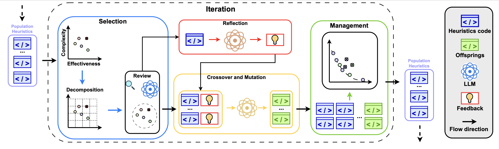
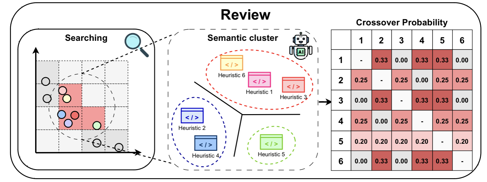
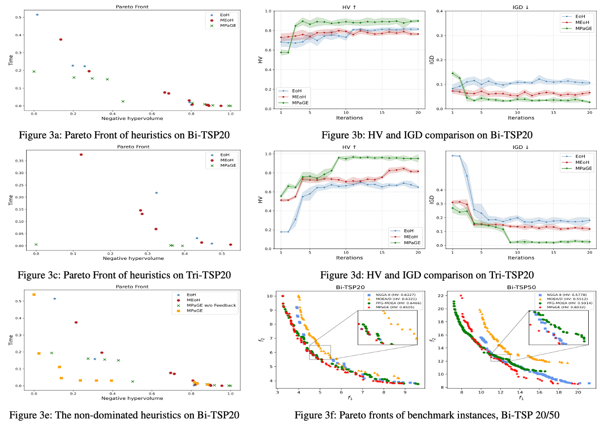
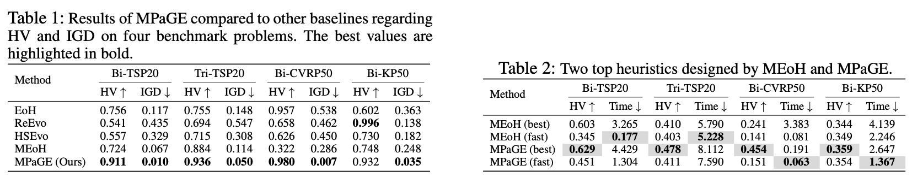
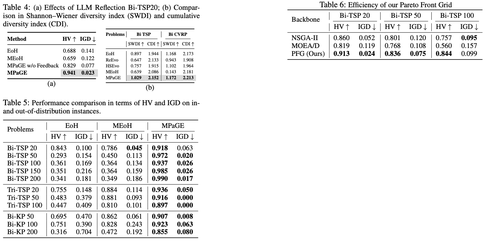

# MPaGE

MPaGE uses LLMs to automatically design heuristics for multi-objective combinatorial optimization (MOCO), balancing runtime, solution quality, and semantic diversity. It combines the SEMO paradigm with Pareto Front Grid guidance and LLM-based heuristic generation.

**Paper:** [MPaGE: Pareto-Grid-Guided Large Language Models for Fast and High-Quality Heuristics Design in Multi-Objective Combinatorial Optimization](https://github.com/langkhachhoha/MPaGE)

## How It Works

MPaGE partitions the objective space into grids, keeps leading individuals from promising regions, and uses LLMs to cluster heuristics by semantic structure. Variation is performed across clusters to promote diversity and reduce redundancy.





## Requirements

- Python 3.8+
- OpenAI API key (or compatible endpoint)

## Installation

```bash
git clone https://github.com/langkhachhoha/MPaGE.git
cd MPaGE
pip install -r requirements.txt
```

## Setup

Create two files in the project root with your API key:

- **`secret.txt`** — main LLM for heuristic generation
- **`secret_cluster.txt`** — LLM for semantic clustering (can be the same key)

Each file: one line, the API key only.

## Running

```bash
python main.py
```

## Configuration

Edit `main.py` to switch problems and tune parameters:

**Problems** (uncomment one):

- `BITSPEvaluation` — Bi-objective TSP (default)
- `TRITSPEvaluation` — Tri-objective TSP
- `BICVRPEvaluation` — Bi-objective CVRP
- `BIKPEvaluation` — Bi-objective Knapsack

**LLM** (OpenAI example):

```python
llm = HttpsApiOpenAI(
    base_url='https://api.openai.com',
    api_key=llm_api_key,
    model='gpt-4o-mini',  # or 'gpt-4', 'gpt-3.5-turbo'
    timeout=30
)
```

**MPaGE parameters:**

| Parameter        | Default | Description                    |
|------------------|---------|--------------------------------|
| `max_sample_nums`| 200     | Maximum function evaluations   |
| `max_generations`| 20      | Maximum generations            |
| `pop_size`       | 6       | Population size                 |
| `num_samplers`   | 1       | Parallel LLM sampling threads  |
| `num_evaluators` | 1       | Parallel evaluation threads    |

## Supported Problems

| Problem  | Module                           |
|----------|----------------------------------|
| Bi-TSP   | `bi_tsp_semo.BITSPEvaluation`    |
| Tri-TSP  | `tri_tsp_semo.TRITSPEvaluation`  |
| Bi-CVRP  | `bi_cvrp.BICVRPEvaluation`       |
| Bi-KP    | `bi_kp.BIKPEvaluation`          |

## Output

Results are written to `logs/YYYYMMDD_HHMMSS_Problem_MPaGE/`:

- `run_log.txt` — execution log
- `population/generation_*.json` — population per generation
- `samples/samples_0~*.json` — generated heuristics

Metrics: hypervolume, runtime, Pareto front size.

## Experiment Results

Evaluation on four MOCO benchmarks:





## Custom Problems

Add a new directory under `llm4ad/task/optimization/` with:

- `evaluation.py` — fitness evaluation
- `get_instance.py` — data loading
- `template.py` — heuristic template and problem description
- `paras.yaml` — parameters

See existing problems (`bi_tsp_semo`, `bi_cvrp`, etc.) as reference.

## Citation

```bibtex
@misc{ha2025paretogridguidedlargelanguagemodels,
  title={Pareto-Grid-Guided Large Language Models for Fast and High-Quality Heuristics Design in Multi-Objective Combinatorial Optimization},
  author={Minh Hieu Ha and Hung Phan and Tung Duy Doan and Tung Dao and Dao Tran and Huynh Thi Thanh Binh},
  year={2025},
  eprint={2507.20923},
  archivePrefix={arXiv},
  primaryClass={cs.NE},
  url={https://arxiv.org/abs/2507.20923},
}
```
